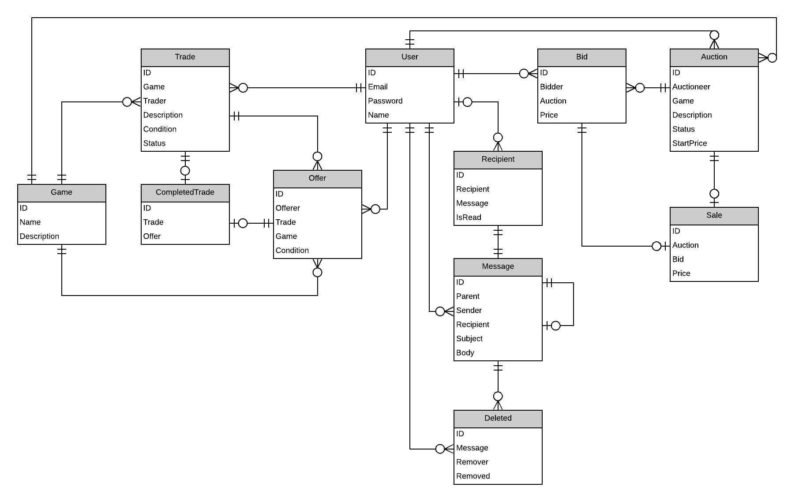

# vBay
vBay is a web based application where users are be able to buy, sell, auction off, bid and trade for games from a personal account in a marketplace within many other people. The application provides a search function which will be filterable by categories such as genre,console platform, year, and many other options. The trading option allows users to trade a game for any other game from any platform and one game may be traded for many other games.

## Getting Started

This repository is for development only and not configured to run on a server. To deploy the app onto a server of your choice you must find those instructions yourself. We have supplied a guide for how to deploy the app via heroku at the [Server-Side Deployment section](#Server-Side-Deployment) using a heroku configured app located in a seperate repository.

### Prerequisites

* Make sure you have at least version 10.3.0 of [node.js](https://nodejs.org/en/download/) installed.

* [PostgreSQL](https://www.postgresql.org/download/) must be installed on your machine.

### Installation

Once you have cloned our repository, you must cd into the vbay directory and install the node dependencies:

    $ cd vbay
    $ npm install --save-dev

Now create a vbay database in postgres:

    $ createdb vbay

Modify the `/vbay/server/config/config.json` to match your username (usually the administrator name for your system), password (if you have assigned one), and port 5432 (default).

Now navigate to the root of the app, `/vbay/` to run the sequelize migration:

    $ sequelize db:migrate

You are now ready to run the development branch of the vBay application. Use this command to run the app:

    $ npm run start:dev

You can visit the server and test the API via this URL:

http://localhost:8000/vbay-api

## Server-Side Deployment

We chose [Heroku](https://www.heroku.com/home) to host our API, using Git to push any changes to the live server.
Of course our app is designed specifically for the Heroku service, but here is how one would deploy the API to Heroku.

### Prerequisites

* Clone the vBay API express app by downloading the zip or pulling via the command line from [Here](https://github.com/JasonKirshner/vbay.git)

* Make sure you have at least version 10.3.0 of [node.js](https://nodejs.org/en/download/) installed.

* Download and install the [Heroku CLI](https://devcenter.heroku.com/articles/heroku-cli#download-and-install) and also create an account if you haven't done so already

* Make sure [Git](https://git-scm.com/downloads) is installed as well.

### Deployment

cd into the `vbay` directory and install all the package dependencies:
    
    $ cd vbay
    $ npm install --save-dev

Now login into heroku and deploy the app:

    $ heroku login
    $ heroku create
    $ git push heroku master

You must now provision a PostgreSQL database. This depends on what your plan is, the free version (our version) is hobby-dev. You must replace the <PLAN_NAME> in the command with your plan:

    $ heroku addons:create heroku-postgresql:<PLAN_NAME>

To migrate the vbay models into the PostgreSQL
 database on heroku do the following using our sequelize command:

    $ heroku run sequelize db:migrate

Your app is now running and you may open it in a browser:

    $ heroku open

You may now test the API using this URL and of course replace the <HEROKU_APP_NAME>:

https://<HEROKU_APP_NAME>.herokuapp.com/vbay-api/

If you have received the message "You have successfully connected to the vbay API", then congratulations, you're officially running your own vBay API!

## Database ER Diagram

## Built With

* [node.js](https://nodejs.org) - JavaScript runtime environment
* [express.js](https://expressjs.com/) - node.js framework
* [Sequelize](http://docs.sequelizejs.com/) - multi-sql ORM tool
* [PostgreSQL](https://www.postgresql.org/) - DBMS
* [Mocha](https://mochajs.org/) - Testing framework
* [Chai](https://www.chaijs.com/) - BDD / TDD assertion library

## Acknowledgements

[Ferdinand Cruz](https://stackoverflow.com/users/8975794/ferdinand-cruz) for supplying the heroku sequelize migration command.

[Jumutri](https://scotch.io/@jmuturi) from [scotch.io](https://scotch.io/) for the tech stack [tutorial](https://scotch.io/tutorials/getting-started-with-node-express-and-postgres-using-sequelize) to get us started.
